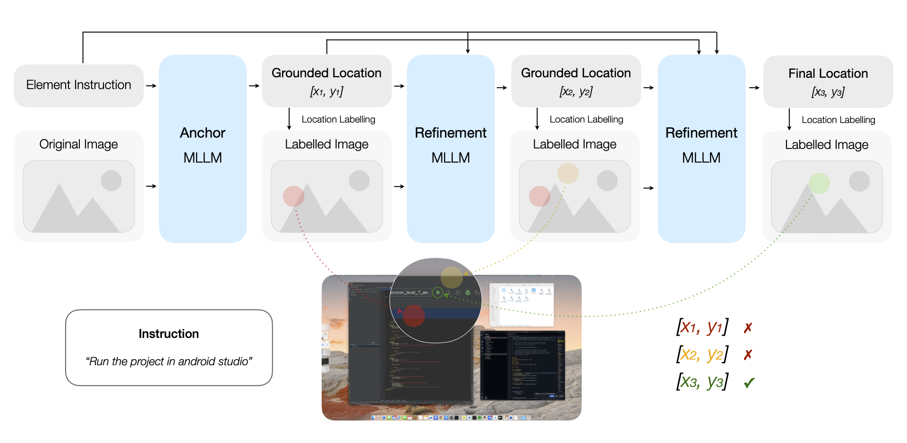

# Chain-of-Ground: Improving GUI Grounding via Iterative Reasoning and Reference Feedback

<div align="center">

[](https://arxiv.org/abs/2512.01979) [](https://arxiv.org/pdf/2512.01979.pdf) [](https://huggingface.co/datasets/chico-research/tpanel-ui)

</div>

## Overview
Chain-of-Ground is a training-free, multi-step framework for GUI grounding. This repo implements triple-layer and two-layer pipelines with iterative reasoning and reference feedback, supports Qwen3-VL and UI-TARS backends, and includes ready-to-run evaluation and visualization tools. We also introduce TPanel-UI, a 420-image dataset of industrial control panels with blur/mask distortions and JSON annotations for precise point grounding.

<div align="center">
  
</div>


## Repository Structure
- `models/ScreenSpot-pro` — screen grounding pipelines tailored for screenshot tasks
- `models/TPanel_UI` — triple-layer and two-layer UI grounding methods and baselines


## Installation

```
pip install pillow requests transformers torch tqdm matplotlib
```

## Setup
- Environment variables:
  - `OPENROUTER_API_KEY` for all models via OpenRouter
  - `DASHSCOPE_API_KEY` for qwen3-vl-32b-instruct

## Quick Start
Dataset download

- TPanel-UI (HuggingFace): https://huggingface.co/datasets/chico-research/tpanel-ui
- ScreenSpot-Pro (HuggingFace):
  - Official: https://huggingface.co/datasets/likaixin/ScreenSpot-Pro
  - Mirror (Voxel51): https://huggingface.co/datasets/Voxel51/ScreenSpot-Pro

Download via CLI:

```
hf download chico-research/tpanel-ui --repo-type dataset --local-dir ./tpanel-ui

# ScreenSpot-Pro (choose one)
hf download likaixin/ScreenSpot-Pro --repo-type dataset --local-dir ./screenspot-pro
# Or use the Voxel51 mirror (their card also shows FiftyOne usage; direct file download works too)
hf download Voxel51/ScreenSpot-Pro --repo-type dataset --local-dir ./screenspot-pro
```

Example directory layout (may vary; refer to dataset card):

```
./tpanel-ui/
  images/                # screenshots
  annotations/                 # test samples (*.json)

./screenspot-pro/
  images/                # high-resolution screenshots
  annotations/           # annotations (bbox, instruction, ui_type, etc.)
```

Batch evaluation parameter mapping:

```
# TPanel-UI
--dataset_type tpanelui --screens_dir ./tpanel-ui/images --tests_dir ./tpanel-ui/jsons

# ScreenSpot-Pro
--dataset_type sspro --screens_dir ./screenspot-pro/images --tests_dir ./screenspot-pro/jsons
```
```

Run pipelines via CLI (OpenRouter only):

```
# Dual-layer (UITars → Qwen) on a single image
python cli/main.py \
  --mode dual \
  --model1 bytedance/ui-tars-1.5-7b \
  --model2 qwen/qwen3-vl-235b-a22b-instruct \
  --instruction "Open Settings" \
  --image /path/to/screenshot.jpg

# Triple-layer Qwen on a single image
python cli/main.py \
  --mode triple \
  --model1 qwen/qwen3-vl-235b-a22b-instruct \
  --model2 qwen/qwen3-vl-235b-a22b-instruct \
  --model3 qwen/qwen3-vl-235b-a22b-instruct \
  --instruction "Open Settings" \
  --image /path/to/screenshot.jpg

# Batch evaluation (sspro or tpanelui)
python cli/main.py \
  --mode triple \
  --model1 qwen/qwen3-vl-235b-a22b-instruct \
  --model2 qwen/qwen3-vl-235b-a22b-instruct \
  --model3 qwen/qwen3-vl-235b-a22b-instruct \
  --batch \
  --dataset_type tpanelui \
  --screens_dir ./tpanel-ui/images \
  --tests_dir ./tpanel-ui/annotations \
  --task all \
  --inst_style instruction \
  --gt_type positive \
  --output ./logs.json
  
```


## Dataset Format
Expected fields (example for a positive sample):

```
{
  "id": "sample_0001",
  "img_filename": "0001.png",
  "img_size": [1920, 1080],
  "bbox": [x1, y1, x2, y2],
  "data_source": "windows",
  "data_type": "text",
  "platform": "windows",
  "application": "explorer",
  "instruction": "Open Settings",
  "language": "en",
  "gt_type": "positive",
  "instruction_style": "instruction"
}
```

Notes:
- `bbox` is `[x1, y1, x2, y2]` in pixel coordinates; scripts normalize internally.
- For negative samples, `gt_type` is `negative` and `bbox` may be omitted.

## Evaluation
The `eval_screenspot_pro.py` script computes metrics and visualizations for a dataset.

Example invocation (requires mapping in `model_factory.py`; otherwise use dynamic import):

```
python eval_screenspot_pro.py \
  --model_type qwen3vl_235b_triple \
  --screenspot_imgs /path/to/images \
  --screenspot_test /path/to/test_jsons \
  --task all \
  --inst_style instruction \
  --gt_type positive \
  --log_path ./logs.json
```

# Result

| 列1 | 列2 | 列3 | |——|——|——| | 数据1 | 数据2 | 数据3 | | 数据4 | 数据5 | 数据6 |


If your model file resides under `models/TPanel_UI` or `models/ScreenSpot-pro`, align import paths in `model_factory.py` or use dynamic import as shown. Note: folders with characters like spaces, hyphens, or parentheses are not Python packages; dynamic import by file path avoids this.


## Pipeline
- Multi-stage architecture: initial detection → refinement → final validation.
- Normalized-to-pixel mapping: model outputs in `[0,1000]` are projected to image pixels and normalized to `[0,1]` for reporting.
- Robust parsing: structured `<tool_call>` JSON preferred; regex fallback for coordinates when formatting is degraded.
- Image scaling: `smart_resize` with factor 32 (Qwen pipelines) or 28 (UITars+Qwen hybrid) preserves fidelity while controlling resolution.
- Resilient inference: retries with exponential backoff for OpenRouter.

### Triple-Layer Qwen (TPanel_UI)
- Layer 1: initial detection with Qwen3-VL-235B.
- Layer 2: refinement given constraints (e.g., region of interest).
- Layer 3: final validation selecting the best candidate.

### Hybrid Triple-Layer (ScreenSpot-pro)
- UITars initial detection (OpenRouter) → Qwen refinement (OpenRouter) → Qwen finalization (OpenRouter).

## Dataset
- Images and JSON annotations with fields: `id`, `img_filename`, `img_size`, `bbox` (x1,y1,x2,y2), `platform`, `application`, `data_type/ui_type`, `instruction`, `language`, `gt_type`, `instruction_style`.
- Positive samples include a target `bbox`; negative samples are explicitly labeled with `gt_type=negative`.
- Dataset: https://huggingface.co/datasets/chico-research/tpanel-ui
- We recommend using the command-line interface to obtain the dataset of this paper: hf download chico-research/tpanel-ui --repo-type dataset --local-dir [your_local_storage_path]

## Experimental Setup
- Environment variables: `OPENROUTER_API_KEY` (OpenRouter).
- Recommended Python: 3.10+; packages: `Pillow`, `requests`, `transformers`, `torch`, `tqdm`, `matplotlib`.
- Seed: `torch.manual_seed(114514)` in `eval_screenspot_pro.py` for replicability.

## Metrics
- Overall accuracy (`action_acc`): fraction of correct predictions among all samples.
- Text/icon accuracy (`text_acc`, `icon_acc`): per-UI-type correctness.
- `wrong_format_num`: number of responses with invalid format.

## Results
We report overall accuracy and per-UI-type accuracy (text, icon). Example highlights:
- ScreenSpot-Pro: 68.4% accuracy (+4.8 points)
- TPanel-UI: +6.9 points over Qwen3‑VL‑235B

Fine-grained reports by platform, application, instruction style, and ground-truth type are produced by the evaluation script. Visualizations for the first N positive samples are saved to `./visualizations_{model_type}`.

## Limitations
- Reliance on external APIs may introduce latency and rate limits.
- Formatting deviations can still degrade parsing despite regex fallbacks.

## Citation

```
@misc{li2025chainofgroundimprovingguigrounding,
    title={Chain-of-Ground: Improving GUI Grounding via Iterative Reasoning and Reference Feedback}, 
    author={Aiden Yiliu Li and Bizhi Yu and Daoan Lei and Tianhe Ren and Shilong Liu},
    year={2025},
    eprint={2512.01979},
    archivePrefix={arXiv},
    primaryClass={cs.AI},
    url={https://arxiv.org/abs/2512.01979}, 
}
```
